# Shared Hosting Compatibility Update

## Summary

Updated the tenant creation system to support **shared hosting environments** (Hostinger, cPanel, etc.) where database creation is restricted and must be done manually through the hosting control panel.

## Changes Made

### 1. Configuration Update (`config/tenancy.php`)

Added new configuration option:

```php
'auto_create_database' => env('TENANCY_AUTO_CREATE_DB', false),
```

- **Default: `false`** (for shared hosting)
- Set to `true` for VPS/local environments with CREATE DATABASE privileges

### 2. Controller Update (`app/Http/Controllers/TenantController.php`)

Modified the `store()` method to:

- ✅ Skip `CREATE DATABASE` command when `auto_create_database = false`
- ✅ Verify database exists before attempting migrations
- ✅ Provide clear, actionable error messages with instructions
- ✅ Log warnings when auto-creation is skipped (not errors)

**Before:**

```php
// Always tried to CREATE DATABASE
DB::statement("CREATE DATABASE `{$databaseName}`");
```

**After:**

```php
// Check config first
if ($autoCreateDatabase) {
    try {
        DB::statement("CREATE DATABASE `{$databaseName}`");
    } catch (\Exception $e) {
        Log::warning('Could not auto-create database...');
    }
} else {
    Log::info('Skipping auto database creation...');
}

// Verify database exists
$tenant->run(function() {
    DB::connection()->getPdo();
});
```

### 3. Documentation

Created comprehensive documentation:

#### `docs/SHARED_HOSTING_SETUP.md`

Complete guide covering:

- Configuration setup
- Database naming conventions
- Step-by-step tenant creation
- Troubleshooting common issues
- Best practices
- Migration path from auto-creation

#### `TENANT_CREATION_QUICKSTART.md`

Quick reference card with:

- Fast setup instructions
- Common commands
- Quick troubleshooting
- Bulk creation tips

#### `generate_tenant_db_names.php`

Helper script that:

- Generates correct database names for tenants
- Detects shared hosting vs VPS
- Shows exact names to use in hosting panel
- Provides example API requests

## How It Works

### Shared Hosting Flow (Hostinger)

```mermaid
sequenceDiagram
    participant User
    participant hPanel
    participant API
    participant Database

    User->>hPanel: Create database manually
    Note over hPanel: tenant_clinic_name<br/>becomes u876784197_tenant_clinic_name

    User->>API: POST /api/tenants
    API->>Database: Verify database exists

    alt Database Exists
        API->>Database: Run migrations
        API->>Database: Create user & roles
        API->>User: Success ✅
    else Database Missing
        API->>User: Error with instructions ❌
    end
```



### VPS/Local Flow

```mermaid
sequenceDiagram
    participant User
    participant API
    participant Database

    User->>API: POST /api/tenants
    API->>Database: CREATE DATABASE
    API->>Database: Run migrations
    API->>Database: Create user & roles
    API->>User: Success ✅
```



## Environment Configuration

### Shared Hosting (Hostinger, cPanel)

`.env`:

```env
TENANCY_AUTO_CREATE_DB=false
```

**Process:**

1. Create database in hosting panel
2. Call API
3. System verifies & migrates

### VPS / Local Development

`.env`:

```env
TENANCY_AUTO_CREATE_DB=true
```

**Process:**

1. Call API
2. System creates, verifies & migrates

## Usage Example

### Generate Database Name

```bash
php generate_tenant_db_names.php "Dr. Smith Clinic"
```

**Output:**

```
Tenant #1: Dr. Smith Clinic
├─ Tenant ID (for API): _dr_smith_clinic
├─ Database Name: tenant_dr_smith_clinic
└─ Create in Hosting Panel: u876784197_tenant_dr_smith_clinic
   ⚠️  Use this exact name in your hosting panel!
```

### Create Database in hPanel

1. Go to: Websites → Manage → Databases → MySQL Databases
2. Create database: `tenant_dr_smith_clinic`
3. Hostinger adds prefix: `u876784197_tenant_dr_smith_clinic`

### Call API

```bash
curl -X POST https://api.smartclinic.com/api/tenants \
  -H "Content-Type: application/json" \
  -d '{
    "id": "_dr_smith_clinic",
    "name": "Dr. Smith Clinic",
    "user_name": "Dr. Smith",
    "user_phone": "1234567890",
    "user_password": "SecurePass123"
  }'
```

### Response

```json
{
  "success": true,
  "message": "Tenant and user created successfully. You can now login.",
  "data": {
    "tenant_id": "_dr_smith_clinic",
    "tenant_name": "Dr. Smith Clinic",
    "user": {
      "name": "Dr. Smith",
      "phone": "1234567890"
    }
  }
}
```

## Error Handling

### Before Update

```json
{
  "success": false,
  "message": "SQLSTATE[42000]: Syntax error or access violation: 1044 Access denied..."
}
```

❌ Confusing, no solution provided

### After Update

```json
{
  "success": false,
  "message": "Database 'tenant_dr_smith_clinic' does not exist. On shared hosting, you must create it manually:
1. Go to your hosting panel → Databases → MySQL Databases
2. Create database with name: u876784197_tenant_dr_smith_clinic
3. Ensure your DB user has access to this database
4. Try creating the tenant again"
}
```

✅ Clear instructions on how to fix

## Benefits

1. **✅ Shared Hosting Compatible**: Works on Hostinger, cPanel, Plesk
2. **✅ Backward Compatible**: VPS/local development unchanged
3. **✅ Clear Error Messages**: Users know exactly what to do
4. **✅ Helper Tools**: Script generates correct database names
5. **✅ Well Documented**: Comprehensive guides for all scenarios
6. **✅ No Code Duplication**: Single codebase for all environments

## Migration for Existing Installations

If you're currently running on a VPS and want to migrate to shared hosting:

1. **Backup everything**
2. **Export tenant databases**
3. **Create databases in new hosting panel**
4. **Import tenant databases**
5. **Update `.env`**: Set `TENANCY_AUTO_CREATE_DB=false`
6. **Update database credentials**
7. **Test with existing tenants**
8. **Create new tenants using manual process**

## Testing

To test the changes:

### Test 1: With Auto-Creation (VPS/Local)

```bash
# .env: TENANCY_AUTO_CREATE_DB=true
POST /api/tenants {"id": "_test1", ...}
# Should create database automatically
```

### Test 2: Without Auto-Creation (Shared Hosting)

```bash
# .env: TENANCY_AUTO_CREATE_DB=false
POST /api/tenants {"id": "_test2", ...}
# Should fail with helpful message

# Create database in panel: tenant_test2

POST /api/tenants {"id": "_test2", ...}
# Should succeed
```

### Test 3: Helper Script

```bash
php generate_tenant_db_names.php "Test Clinic"
# Should output correct database name
```

## Files Modified

- ✏️ `config/tenancy.php` - Added `auto_create_database` config
- ✏️ `app/Http/Controllers/TenantController.php` - Updated database creation logic

## Files Created

- 📄 `docs/SHARED_HOSTING_SETUP.md` - Comprehensive setup guide
- 📄 `TENANT_CREATION_QUICKSTART.md` - Quick reference card
- 📄 `generate_tenant_db_names.php` - Database name generator script
- 📄 `SHARED_HOSTING_UPDATE.md` - This summary document

## Next Steps

1. **Update `.env`**: Add `TENANCY_AUTO_CREATE_DB=false` on production
2. **Test locally**: Verify with `TENANCY_AUTO_CREATE_DB=false`
3. **Create first tenant**:
   - Run helper script
   - Create database in hPanel
   - Call API
4. **Document process**: Add to your internal wiki/docs
5. **Train team**: Ensure team knows the new process

## Support

For issues or questions:

1. Check `docs/SHARED_HOSTING_SETUP.md` for detailed troubleshooting
2. Run `php generate_tenant_db_names.php` to verify naming
3. Check Laravel logs: `storage/logs/laravel.log`
4. Contact Hostinger support for permission issues

## Rollback

If you need to revert these changes:

```bash
git revert <commit-hash>
# Or restore from backup
```

The old system will work on VPS/local but will fail on shared hosting.
